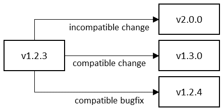

# Microservice versioning
The evolution of a microservice can be a difficult and a complex task. When a microservice has reached a point where it’s difficult to expand beyond the original intent or functionality is added, updated or removed, it’s time to consider the next release version of its API.

The following salient questions should be considered when migrating to the next version of a microservice:

 - Is the change backwards compatible with the existing API?
 - Is the change related to a backwards compatible bug fix of a released version of an existing API?
 - Is the update backwards incompatible with the existing API?

The above questions should be considered by development teams when updates are made to externally facing interfaces.

## Microservice types
A microservice architecture makes a distinction between external (open) and internal (private) microservice APIs. Each microservice is defined as either of type external or internal, depending on whether it targets external or in-house developers. An SDK bundles external microservice APIs, presenting a unified entry point for consumers of backend services. Whereas, internal APIs facilitate communication between backend services.

## Using strong contracts
One of the most important aspects of microservices-based applications is the ability to deploy microservices completely independent of one another. To achieve this independence, each microservice must provide a versioned, well-defined contract to its clients. Each service must not break these versioned contracts until it's known that no other microservice relies on a particular, versioned contract. It is critical to account for this in the deprecation policy of external APIs bundled in a versioned SDK release.

Implementation of strongly versioned contracts can be one of the most challenging aspects to adopt in stable microservice-based application development. It is imperative that the development team internalize and understand the difference between breaking and non-breaking changes made to a given API. They must understand how and when an older API version can be retired from service. Development teams and management must employ appropriate communication techniques, including such things as depreciation and release notices in SDK documentation.

## The semantic version format
Semantic versioning will be employed in the implementation of a versioning contract of microservice APIs. In essence semantic versioning introduce a hierarchical three-number versioning scheme <major>.<minor>.<patch>, which provides semantics to denote different levels of changes in a microservice API.

 - **Major**: This number is incremented for incompatible breaking changes, such as removing an existing operation. For example, a breaking change to v1.2.3 will result in a new v2.0.0.
 - **Minor**: This number is incremented if new functionality is added in a compatible manner, such as adding a new operation to an API or adding a new feature to an existing API operation. For example, a compatible extension to v1.2.3 will result in a new v1.3.0.
 - **Patch**: This number is incremented for compatible bugfix made to a released version, such as changing and clarifying the documentation in an API contract or changing the API implementation to fix a logic error. For example, a compatible bug fix to v1.2.3 will result in a new v1.2.4.

The use of schematic versioning is illustrated in Figure 1:



Figure 1: Version Number Changes

## Rules for increasing versions
When changes are made to a microservice, it is important that one or more components of the version are updated as well, so that the new version implicitly indicates the type of changes you made to the code. This is accomplished by application of the following rules when updates are being made:

 1. Each increment happens numerically with an increment of 1.
 2. When a bug fix is applied to a released version of the API and the API remains backwards compatible, increase the patch component:
    ```
    v1.2.3 // before bug fix
    v1.2.4 // after bug fix
    ```
3. When additional functionality is added to a released version of the API and the API remains backwards compatible, increase the minor component and reset the patch component to 0:
    ```
    v1.2.3 // before additional functionality added
    v1.3.0 // after additional functionality added
    ```
4. When additional functionality is added to a released version of the API and the API is not backwards compatible, increase the major component and reset the minor and patch components to 0:
    ```
    v1.2.3 // before introduction of backwards incompatible changes
    v2.0.0 // after introduction of backwards incompatible change
    ```
