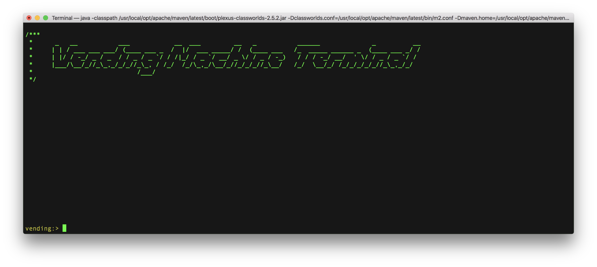
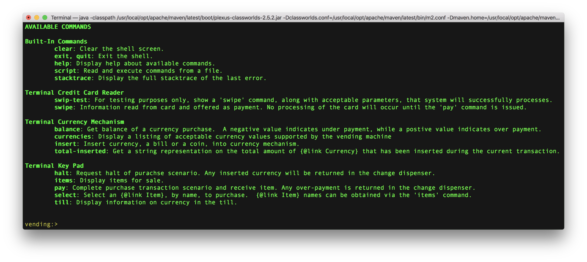
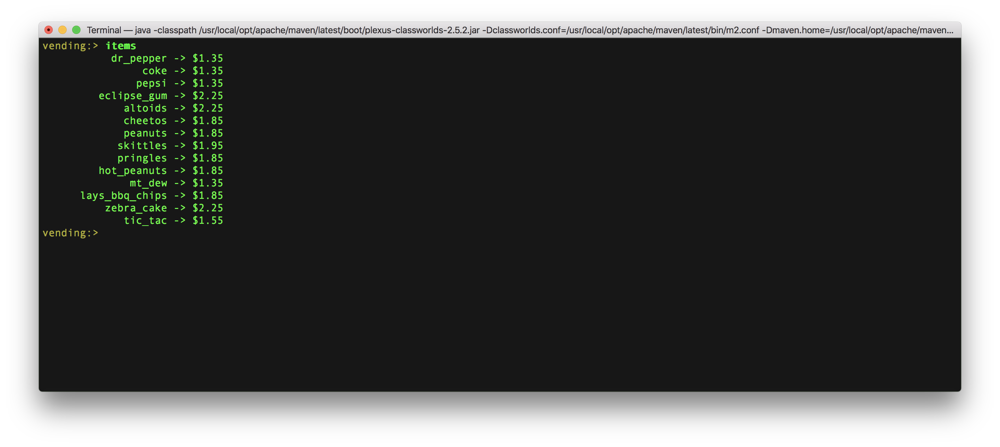
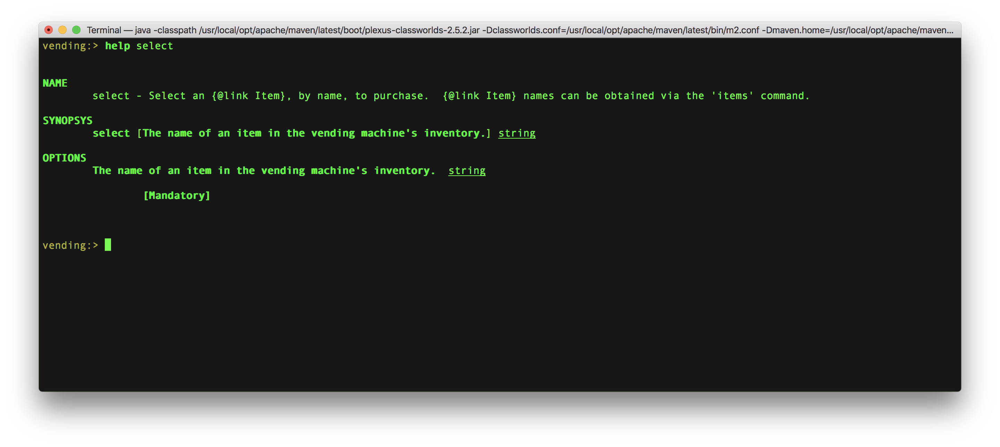
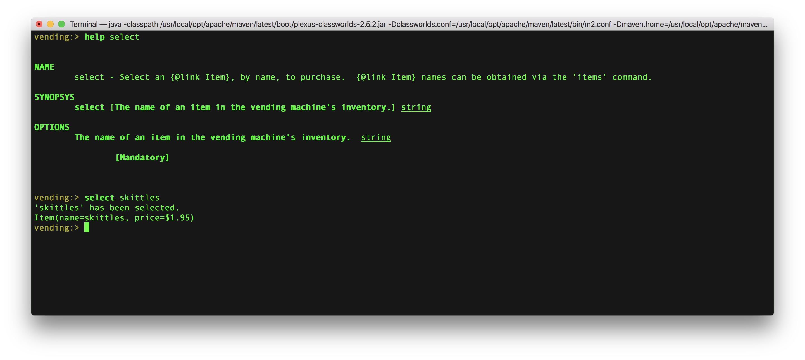
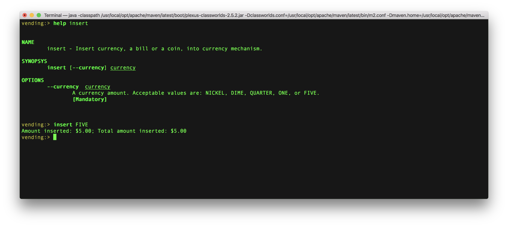
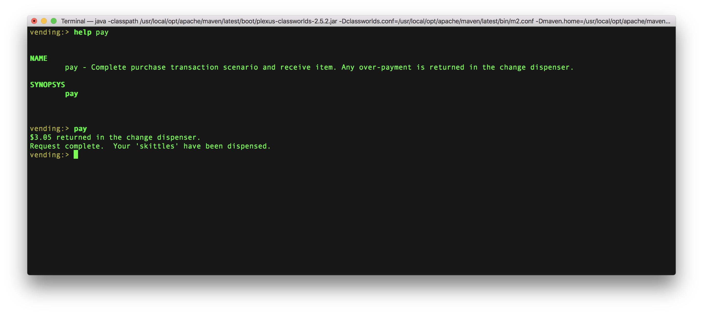

# Vending Machine Challenge

## Problem Statement

Design and code an implementation of a vending machine that can handle different products, can accept payments, and can vend product.

You are designing software for a variety of real vending machines that handle different product types. Keep this in mind as you design.
For example, your design for dispensing the product would need to be able to handle the logic that drives the mechanical aspects of
various types of machines. For the demonstration, your dispense mechanism would dispense to the system console and/or a mock class.
In future production implementations, the dispense mechanism may drive different types of motors that dispense the product.  

In this example, the UI for the vending machine will be the system console.

## Assumptions

- The vending machine only accepts US currency.  In particular, it only accepts the following:
    - Bills: one dollar bills and five dollar bill
    - Coins: nickel, dime, and quarter
- To simplify calculations and to avoid any potential rounding uses, currency values are represented as integral values. Such as:
    - 100 would represent the value of a one dollar bill
    - 25 would represent the value of a quarter
    - 5 would represent the value of a nickel
- The assumption was made that a user could only purchase a single item a time.
    - For example, a user is not permitted to purchase a Coke and Pringles in the same transaction.  Purchasing two items would require two 
    distinct interactions with the systems.
- An assumption was made that credit card transactions has a higher precedence over currency.  The system will allow a user to offer currency
and credit card for payment of purchased items.  However, when the user submits a request for payment of a selected item the system will 
process the credit card first, before attempting to reconcile payment from inserted currency.  In such a scenario, the system will only consider 
inserted currency for payment if and only if the credit card charge was declined.
    - Payment for items can not be split between currency payments and a credit card charge.

## Terminal UI
[Spring Shell](https://projects.spring.io/spring-shell/) was used extensively for development of the Vending Machine Terminal.  The use of the 
Spring Shell project allows development of a full featured shell ( a.k.a. command line) application with minimum effort. Spring Shell v2.0 
has various enhancements which promotes integration with Spring Boot. Incorporation into the Spring Boot ecosystem makes it easy to create stand-alone, 
Spring Shell based Applications that <b>just run</b>. 

### Spring Shell Features

Spring Shell's features include:

- A simple, annotation driven, programming model to contribute custom commands
- Use of Spring Boot auto-configuration functionality as the basis for a command plug-in strategy
- Tab completion, colorization, and script execution
- Customization of command prompt, shell history file name, handling of results and errors
- Dynamic enablement of commands based on domain specific criteria
- Integration with the bean validation API
- Already built-in commands, such as clear screen, gorgeous help, exit, etc.
- ASCII art Tables, with formatting, alignment, fancy borders, etc.

## Quick Start
This section walks you through the process of obtaining and running the Vending Machine Terminal application.  Do the following from the command line:

- Clone the [sandbox](https://github.com/jefferyedwards/sandbox.git) repository using Git:

> git clone https://github.com/jefferyedwards/sandbox.git

- Change directory to the vending project:

> cd sandbox/vending

- The `vending` machine project is a Maven project that uses the `spring-boot-maven-plugin plugin` to package an executable über jar archive and run an 
application _in-place_.  The following command will build and run the application:

> mvn spring-boot:run

- Use the `help` to see commands supported by the application:

> vending:> help

- One of the commands provided by the `Terminal Key Pad` component is `items`.  This command allows a user to see the current inventory of items (and their
corresponding price) available for purchase from the vending machine.

> vending:> items

- Selection of an item for purchase is handled by the `select` command.  Usage information on the `select` command can be obtained as follows:

> vending:> help select 

> The above shows the `select` command requires the `--name` option.  Acceptable values of `--name` are obtained from issuing the `items` command.  To select 
`skiittles` (a inventory item) for purchase issue the following command:
 
> vending:> select skittles

- The following illustrates offering currency as payment of a selected item:

> vending:> help insert

> vending:> insert FIVE

- Use the `pay` command to finalize the payment transaction and receive the item:

> vending:> help pay

> vending:> pay

